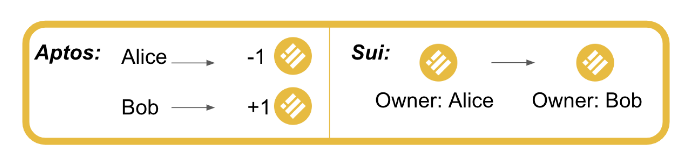
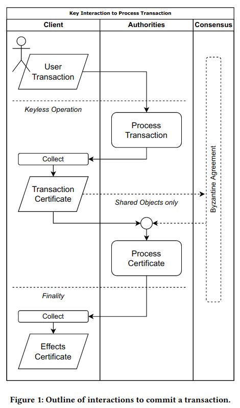
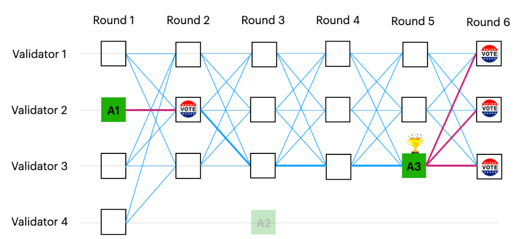
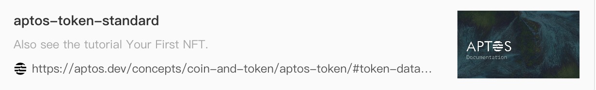

# Sui and Move

**Shared by: bigK, wcy**

## Founders

facebook libra team

## Funding

300M Series B

## Ecosystem

## Technology

## Whitepaper

[https://raw.githubusercontent.com/MystenLabs/sui/main/doc/paper/sui.pdf](https://raw.githubusercontent.com/MystenLabs/sui/main/doc/paper/sui.pdf)

## Docs

[How Sui Works](https://docs.sui.io/devnet/learn/how-sui-works)

[Built for Speed: Under the Hoods of Aptos and Sui](https://medium.com/amber-group/built-for-speed-under-the-hoods-of-aptos-and-sui-3f0ae5410f6d)

## Key features compared to other blockchains

- [Causal order vs. total order](https://docs.sui.io/devnet/learn/sui-compared#causal-order-vs-total-order) enables
  massively parallel execution
- [Sui's variant of Move](https://docs.sui.io/devnet/build/move) and its object-centric data model make composable
  objects/NFTs possible
- The blockchain-oriented [Move programming language](https://github.com/MystenLabs/awesome-move) eases the developer
  experience

## Move

Sui specific Move:

There are four Sui-specific object operations. Each of these operations changes the ownership metadata of the object and
returns it to the global object pool. Most simply, a Sui object can be transferred to the address of a Sui end-user. An
object can also be transferred to another parent object.

An object can be mutably shared so it can be read/written by anyone in the Sui system. Finally, an object can be
immutably shared so it can be read by anyone in the Sui system, but not written by anyone.

The ability to distinguish between **different kinds of ownership** is a unique feature of Sui.

### Object

- Every object in Sui has a unique version number.
- Every new version is created from a transaction that may involve several dependencies, themselves versioned objects.



## Account

Similar to Aptos:

The separation between addresses and authenticators enables cryptographic agility. An authenticator can be a public key
from any signature scheme, even if the schemes use different key lengths (e.g., to support post-quantum signatures). In
addition, an authenticator need not be a single public key–it could also be (e.g.) a K-of-N multisig key.

## Execution

### High level

- global locks for owned objects: use simpler algorithms based
  on [Byzantine Consistent Broadcast](https://link.springer.com/book/10.1007/978-3-642-15260-3)
- consensus for shared objects

The rules ensure that execution for transactions involving read-only and owned objects requires only consistent
broadcast and a single certificate to proceed; and Byzantine agreement is only required for transactions involving
shared objects.

### Eventual consistency

- Eventual delivery - if one honest validator processes a transaction, all other honest validators will eventually do
  the same.
- Convergence - two validators that have seen the same set of
  transactions share the same view of the system (reach the same state).

### **Causal order vs. total order**

Unlike most existing blockchain systems (and as the reader may have guessed from the description of write requests
above), Sui does not always impose a total order on the transactions submitted by clients, with shared objects being the
exception. Instead, many transactions are *causally* ordered.

### Transaction Flow



### Simple Transaction

Simple transaction (owned object) submission follows these steps:

1. The sender broadcasts a transaction to all Sui validators.
2. Each Sui validator replies with an individual vote for this transaction. Each vote has a certain weight based on the
   stake owned by the validator.
3. The sender collects a Byzantine-resistant-majority of these votes into a *certificate* and broadcasts that back to
   all Sui validators. This settles the transaction, ensuring *finality* that the transaction will not be dropped (
   revoked).
4. Optionally, the sender collects a certificate detailing the effects of the transaction.

### Complex Transaction

When shared objects are involved, transaction submission follows these steps:

1. The sender broadcasts a transaction to all Sui validators.
2. Each Sui validator replies with an individual vote for this transaction. Each vote has a certain weight based on the
   stake owned by the validator.
3. The sender collects a Byzantine-resistant-majority of these votes into a certificate and broadcasts it back to all
   Sui validators. *This time however, the certificate is sequenced through Byzantine Agreement.*
4. Once the transaction has been successfully sequenced, the user broadcasts again the certificate to the validators to
   settle the transaction.

### Details

When a validator receives a transaction from a client, it will first perform transaction validity checks (e.g., validity
of the sender's signature). If the checks pass, the validator locks all owned-objects and signs the transaction bytes.
It then returns the signature to the client. The client repeats this process with multiple validators until it has
collected signatures on its transaction from a committee, thereby forming a certificate.

Once the client forms a certificate, it submits the certificate to a validator, which will perform certificate validity
checks (e.g., ensuring the signers are validators in the current epoch, and the signatures are cryptographically valid).
If the checks pass, the authority will execute the transaction inside the certificate. Execution of a transaction will
either succeed and commit all of its effects to the ledger, or abort (e.g., due to an explicit `abort` instruction, a
runtime error such as division by zero, or exceeding the maximum gas budget) and have no effects other than debiting the
transaction's gas input. In either case, the transaction will durably store the certificate indexed by the hash of its
inner transaction.

As with transactions, we note that the process of sharing a certificate with validators can be parallelized and (if
desired) outsourced to a third-party service provider. A client should broadcast its certificate to >1/3 of the
validators to ensure that (up to BFT assumptions) at least one honest validator has executed and committed the
certificate. Other validators may learn about the certificate via inter-validator state sync or via client-assisted
state sync.

## Consensus

DAG-based consensus: Sui takes advantage
of [Narwhal and Tusk: A DAG-based Mempool and Efficient BFT Consensus](https://docs.sui.io/devnet/learn/architecture/consensus)
and the Tusk successor [Bullshark](https://arxiv.org/abs/2201.05677). Narwhal/Bullshark (N/B) are also being implemented
by [Mysten Labs](https://mystenlabs.com/) so that when Byzantine agreement is required we use a high-throughput
DAG-based consensus to manage shared locks while execution on different shared objects is parallelized.

[DAG Meets BFT - The Next Generation of BFT Consensus](https://decentralizedthoughts.github.io/2022-06-28-DAG-meets-BFT/)

### DAG BFT

The idea of DAG-based BFT consensus is to separate the network communication layer from the consensus logic. Each
message contains a set of transactions, and a set of references to previous messages. Together, all the messages form a
DAG that keeps growing – a message is a vertex and its references are edges.

The consensus logic adds zero communication overhead. That is, each validator independently looks at its local view of
the DAG and totally (fully) orders all the vertices without sending a single extra message. This is done by interpreting
the structure of the DAG as a consensus protocol, i.e., a vertex can be a proposal and an edge can be a vote.

Importantly, due to the asynchronous nature of the network, different validators may see slightly different DAGs at any
point in time. A key challenge then is how to guarantee that all the validators agree on the same total order.



### Consensus in SUI

Consensus is used to sequence transactions : The output of N/B is therefore a sequence of transactions, with
interdependencies stored in the transaction data itself.

Consensus sequences certificates of transactions. These represent transactions that have already been presented to 2/3
of validators that checked that all their owned objects are available to be operated on and signed the transaction. Upon
a certificate being sequenced, what we do is set the *lock* of the shared objects at the next available version to map
to the execution of that certificate. Now, once this is done Sui can execute all certificates that had their locks set,
on one or multiple cores (currently).

Sui’s consensus engine comprises of two parts:

- ensuring the availability of data submitted to consensus = [Narwhal](https://arxiv.org/abs/2105.11827)
- agreeing on a specific ordering of this data
  = [Bullshark](https://arxiv.org/abs/2201.05677) > [Tusk](https://github.com/MystenLabs/narwhal)

## Performance

**Throughput**. To ensure that more resources result in increased capacity quasi-linearly, the Sui design aggressively
reduces bottlenecks and points of synchronization requiring global locks within authorities. Processing transactions is
cleanly separated into two phases, namely (1) ensuring the transaction has exclusive access to the owned or shared
objects at a specific version, and (2) then subsequently executing the transaction and committing its effects.

Phase (1) requires a transaction acquiring distributed locks at the granularity of objects. For owned objects this is
performed trough a reliable broadcast primitive, that requires no global synchronization within the authority, and
therefore can be scaled through sharding the management of locks across multiple machines by ObjID. For transactions
involving shared objects sequencing is required using a consensus protocol, which does impose a global order on these
transactions and has the potential to be a bottleneck. However, recent advances on engineering high-throughput consensus
protocols demonstrate that sequential execution is the bottleneck in state machine replication, not sequencing. In Sui,
sequencing is only used to determine a version for the input shared object, namely incrementing an object version number
and associating it with the transaction digest, rather than performing sequential execution.

Phase (2) takes place when the version of all input objects is known to an authority (and safely agreed across
authorities) and involves execution of the Move transaction and commitment of its effects. Once the version of input
objects is known, execution can take place completely in parallel. Move virtual machines on multiple cores or physical
machines read the versioned input objects, execute, and write the resulting objects from and to stores. The consistency
requirements on stores for objects and transactions (besides the order lock map) are very loose, allowing scalable
distributed key-value stores to be used internally by each authority. Execution is idempotent, making even crashes or
hardware failures on components handling execution easy to recover from.

As a result, execution for transactions that are not causally related to each other can proceed in parallel. Smart
contract designers may therefore design the data model of objects and operations within their contracts to take
advantage of this parallelism.

**Latency**. Smart contract designers are given the flexibility to control the latency of operations they define,
depending on whether they involve owned or shared objects. Owned objects rely on a reliable broadcast before execution
and commit, which requires two round trips to a quorum of authorities to reach finality. Operations involving shared
objects, on the other hand, require a a consistent broadcast to create a certificate, and then be processed within a
consensus protocol, leading to increased latency (4 to 8 round trips to quorums as of [9]).

## Gas

This delivers good user experience to Sui users, who can focus on using the Sui network without worrying about having to
forecast the current market price of gas fees.

$GasFees[\tau] \ = \ ComputationUnits[\tau] \times ComputationPrice[\tau] \ + \ StorageUnits[\tau] \times StoragePrice$

$ComputationPrice[\tau] \ = \ ReferencePrice \ + \ Tip[\tau]$

$\text{with } \ ComputationPrice[\tau] > PriceFloor$

For validators:

$RewardShare(v) = Constant \times (1 + GasSurveyBoost) \times Multiplier(v) \times StakeShare(v)$

Gas Price Survey: validators submit their reference price every epoch

GasSurveyBoost - incentivize lower reference price during submission

Multiplier - incentivize honoring the quote

## Storage Fund

## Why Move

* 安全。让用户加签时掌握tx背后的资产转移细节。
    * evm系的sign完全黑盒，用户不知道签完后是eth归零，还是nft被转走；

    * aptos 通过simulate（类似eth的estimate gas) 来保证安全，simulate会模拟执行一次tx,
      然后将对resource的写操作详情和删除操作详情返回给客户端；

    * sui 访问合约的方法，需要将object作为参数传递，而且需要明确指定object的访问权限(读，写，转移)
      ，所以用户在调用一个方法时可以完全知道object会被赋予什么操作权限；

* 并行执行。得益于move的存储结构，不相关的resources可以并行修改，提高系统吞吐。

## Sui-move vs core-move

```text
core-move全局存储结构伪代码
struct GlobalStorage {
resources: Map<(address, ResourceType), ResourceValue>
modules: Map<(address, ModuleName), ModuleBytecode>
}

sui-move全局存储结构伪代码
struct GlobalStorage {
objects: Map<id,ObjectValue>
}
```

core-move是以 address + type 做为索引来存储数据，sui-move通过 object-id 做为索引来存储数据，然后通过在 ObjectValue 上添加
owner 字段来维护所有权。

因为sui使用了自定义的以object为中心的全局存储结构，所以在sui-move里面不能使用core-move的全局存储操作方法(
move_to,move_from,borrow_global_mut,borrow_global,exists)，取而代之的是sui::transfer module提供一系列方法。

## DApp在Move系和Solidity系下读取数据的方式对比

solidity体系支持 eth_call, eth_getStorageAt
的方式获取数据（其他rpc-api获取数据的方式都可以归纳为和eth_getStorageAt一样的原理）。eth_getStorageAt可以理解为就是通过指定数据的指针地址，然后读取数据，直接返回，eth_call是调用合约的只读方法，项目方可以通过只读方法来自定义获取数据的逻辑，可以将读取到的链上数据修改后再返回。

move体系只能通过类似eth_getStorageAt这样指定数据指针地址，然后读取数据，直接返回的方式来读取数据，不能将读取到的数据修改后再返回。

## 两种 token standard 实现方案的对比

* evm生态的 token standard 都是通过 EIP 的方式进行一个乐观锁的约束。比如一个合约说它实现了eip721，那么我们乐观地认为它是按照eip721标准正确地实现了所有的方法。

    * 优点： 非常灵活，项目方可以按照自己的逻辑来实现一切定制化需求，比如给某个系列的NFT设置一个黑名单，无论如何黑名单用户都不能持有该系列的NFT。

    * 缺点：bug, 项目方留后门，每一个新项目都需要重新进行合约的安全审计。

* move 生态下可以通过phantom泛型来实现token standard。phantom泛型可以这样理解，以erc20举例，公链自己实现一个合约叫做
  coin-contract, 里面定义了一个基础类型叫Coin，同时给Coin类型定义了transfer方法用于转账；然后假设 Bored Ape 想要发行 APE,
  那么这时候发行的就是 Coin<APE>， 除了name,symbol,decimals等特有属性不一样之外，其他的逻辑完全复用 Coin的逻辑。

    * 缺点：不灵活，所有的方法都是在基础类型中定义好的，不能覆盖。

    * 优点：无bug,不用写代码自然就不会产生bug。无后门，方法都实现好了，不能覆盖。新项目不需要进行安全审计，放心冲，只需要对公链项目方自己实现的基础module进行一次审计就够了。

## move系 token standard 实现现状

因为move系读取数据方式与solidity系的不同，eip20, eip721, eip1155......等提议都不能直接在move体系下一比一复刻。

因为 erc20 的属性和 gas token 一致，aptos, sui都是通过phantom泛型来实现了 erc20。

然而 erc721, erc1155的玩法非常多， 目前sui 还没有phantom泛型版本的 erc721,erc1155的实现， aptos 把当前
721,1155,opensea等的常用逻辑整理出来，实现了一个phantom泛型版本的token
standard:  0x3::aptos_token::token 。

<a href="https://aptos.dev/concepts/coin-and-token/aptos-token#token-data-model" target="_blank">

</a>


## 私有化结构体操作

* 结构体类型只能在定义结构体的模块内创建和销毁。

* 结构体的字段只能在定义结构体的模块内部访问。

move的struct不能添加可见性描述符，永远是public，所以struct总是能够被其他的module或script访问；

但是struct的字段全都是私有的，
<span style="color:#2EDEBD;" id="struct-rule">想要访问struct的字段，只能通过在定义该struct的module里面添加 public fun
。</span>
高亮这段规则，决定了move体系下所有dapp在开发过程中怎么写出安全性和灵活性并存的合约。

## 不同move引擎下的market实现

在solidity体系下market dapp都依赖于 approval 方法来实现，用户给 market合约 授予需要流通的token 的访问权限， 然后 market
再做一套撮合系统(order book), 买卖双方通过撮合系统+market合约来完成资产交换。

在move体系下，只有owner才有token的所有权，不能进行approval操作。

aptos 通过 object_wrapper + resource_account 来实现market dapp。
先说说object_wrapper的作用，限制token只能通过合约指定的交易方法进行转移。原本token是可以不受限制地进行转移的，就像你可以把一个nft从大号直接转到自己的小号，你如果直接把nft转给market合约，market合约的控制账户就可以直接把你的nft转到自己名下了；参考上面的【私有化结构体操作】限制，我们只需要定义一个新的struct
, 然后把nft做为一个内部字段塞入struct,就得到一个wrapper，然而market合约已经定义了wrapper只能通过特定的方法进行转移，比如
swap。这样就限制住了token的转移只能通过交易来进行。
但是问题又来了，这个时候wrapper还是可以被随意转移的，所以需要把wrapper放置在resource_account的存储空间里面。resource_account类似solidity的合约账户，不一样的是resource_acccount可以签名，不存在ethereum合约账户不能和market合约交互的问题，
只要market项目方把resource_account的控制权移交给0x0地址，整个token swap 的流程就都是安全可靠的了。

sui通过 object_wrapper + shared_object 来实现 market dapp。 使用object_wrapper的原因和aptos一样。
shared_object在sui里面是任何人都可以读写的object。把一个wrapper
转移到shared_object下面，就人人都能访问了，只不过访问的方式被定义shared_object的合约限制成了只能通过交易的方式。

## Sui 版本的crypto kitties: Capy (财富密码)

[https://capy.art/marketplace/capys](https://capy.art/marketplace/capys)